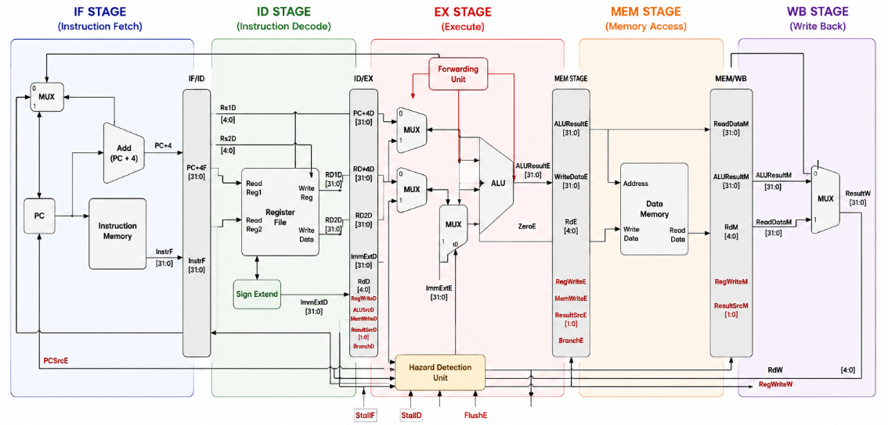
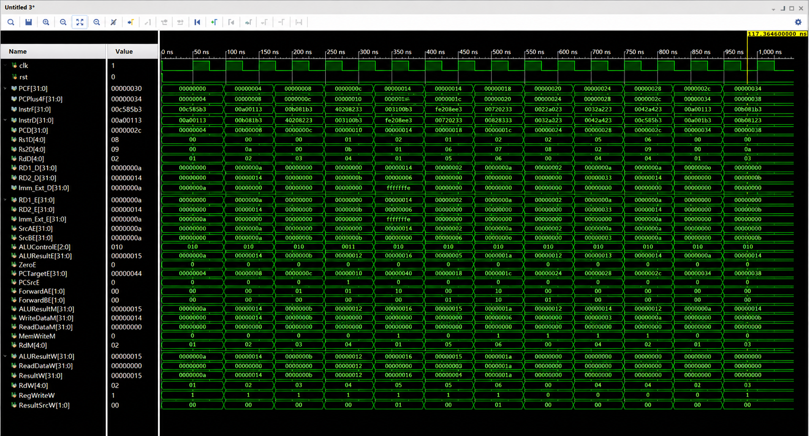

# 🖥️ 5-Stage Pipelined RISC-V 32I Processor

A synthesizable **32-bit 5-stage pipelined RISC-V processor** implemented in **Verilog HDL**, featuring a modular datapath, control path, pipeline registers, hazard detection, and data forwarding.

> **Developed and simulated using Xilinx Vivado 2022.2**

---

## 📖 Project Overview

This project implements a **5-stage pipelined RISC-V 32I processor** by dividing instruction execution into five stages:

**IF → ID → EX → MEM → WB**

- **IF** — Instruction Fetch
- **ID** — Instruction Decode
- **EX** — Execute
- **MEM** — Memory Access
- **WB** — Write Back

The pipeline allows multiple instructions to be processed simultaneously, improving processor throughput.

---

## ✨ Features

- ✔️ 32-bit RISC-V architecture
- ✔️ 5-stage instruction pipeline
- ✔️ Modular Verilog RTL design
- ✔️ 32-bit ALU
- ✔️ Register file
- ✔️ Immediate generator
- ✔️ Instruction and data memory
- ✔️ Control unit
- ✔️ Pipeline registers
- ✔️ Data forwarding
- ✔️ Hazard detection
- ✔️ Pipeline stalling and flushing
- ✔️ Branch handling
- ✔️ Vivado simulation and waveform verification

---

## 🏗️ Processor Architecture

## 🧩 Module Description

| Module | Function |
|---|---|
| `riscv.v` | Top-level processor module |
| `datapath.v` | Implements the 5-stage pipelined datapath |
| `controlpath.v` | Propagates control signals through pipeline stages |
| `control_unit.v` | Generates the main control signals |
| `alu_control.v` | Generates ALU operation control signals |
| `alu_32_bit.v` | Implements the 32-bit ALU |
| `alu_operations.v` | Implements arithmetic and logical operations |
| `register_file.v` | Implements the 32 × 32-bit register file |
| `instruction_mem.v` | Stores and provides processor instructions |
| `DataMemory.v` | Handles data memory read/write operations |
| `immediate_gen.v` | Generates and sign-extends immediate values |
| `hazard_unit.v` | Handles data hazards, forwarding, stalls and flushes |
| `flopenrc.v` | Implements pipeline registers |
| `mux2_32.v` | 2-to-1 32-bit multiplexer |
| `mux4x1.v` | 4-to-1 32-bit multiplexer |
| `adder.v` | 32-bit adder |
| `pc.v` | Program Counter |

---

## ⚙️ Hazard Handling

The processor includes a **hazard unit** to maintain correct execution when instructions depend on each other.

### 🔹 Data Forwarding

Forwarding is used to provide results directly from later pipeline stages to the EX stage, reducing unnecessary stalls.

### 🔹 Pipeline Stalling

The pipeline can be stalled when a data dependency cannot be resolved through forwarding, such as a load-use hazard.

### 🔹 Pipeline Flushing

Branch instructions can cause incorrect instructions to enter the pipeline. These instructions are removed using pipeline flushing.

---

## 📊 Simulation Results

The simulation waveform verifies the correct operation of the 5-stage pipeline, including:

- ✔️ Program Counter operation
- ✔️ Instruction Fetch
- ✔️ Instruction Decode
- ✔️ Register values
- ✔️ Immediate generation
- ✔️ ALU operations
- ✔️ Memory read/write
- ✔️ Register Write Back
- ✔️ Data forwarding
- ✔️ Pipeline stalls
- ✔️ Pipeline flushing

### Important Waveform Signals

## 🛠️ Tools Used

- **Verilog HDL**
- **Xilinx Vivado 2022.2**
- **Vivado XSim**
- **Visual Studio Code**

---

## 🚀 Future Improvements

- Support additional RV32I instructions
- Improve branch handling
- Add cache memory
- Increase memory capacity
- Implement FPGA deployment
- Add processor performance analysis

---

## 🎯 Learning Outcomes

This project provides practical experience in:

- RISC-V processor architecture
- 5-stage pipelining
- Datapath and control-path design
- Pipeline registers
- Data hazard handling
- Forwarding and stalling
- Verilog RTL design
- Hardware simulation and verification

---

## 👩‍💻 Author

**Archita Roy**  
B.Tech – Electronics and Communication Engineering  
**National Institute of Technology Silchar**

GitHub: [@archita-2005](https://github.com/archita-2005)

---

⭐ **Feedbacks are always welcomed!**
